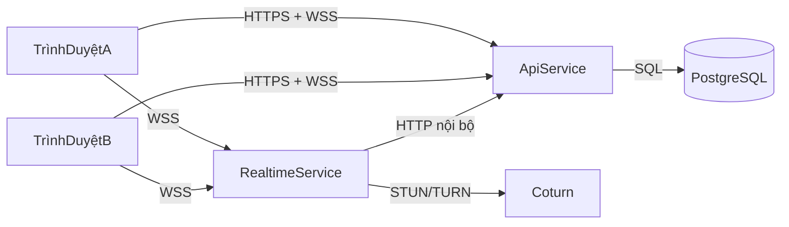

# 01 - Kiến Trúc Tổng Thể

## Mục tiêu

Tài liệu này chốt kiến trúc hệ thống để cả nhóm có cùng cách hiểu về ranh giới dịch vụ, luồng dữ liệu, bảo mật và hướng mở rộng.

## Phạm vi

- Trong phạm vi:
  - Chat 1-1 có E2EE.
  - Gọi 1-1 gồm thoại và video qua WebRTC.
  - Có thể triển khai ở hạ tầng miễn phí, có CI/CD.
- Ngoài phạm vi:
  - Double Ratchet đầy đủ như Signal.
  - Đồng bộ nhiều thiết bị ở mức nâng cao.
  - Logic group chat hoàn chỉnh ở phiên bản đầu.

## Bối cảnh hệ thống

## Ranh giới trách nhiệm

### API Service

- Quản lý xác thực và phân quyền.
- Quản lý nghiệp vụ và lưu trữ dữ liệu bền vững.
- Quản lý hợp đồng REST API và migration.

### Realtime Service

- Quản lý kết nối socket.
- Quản lý presence và signaling.
- Không sở hữu dữ liệu nghiệp vụ bền vững.

### Frontend

- Mã hóa và giải mã dữ liệu.
- Quản lý vòng đời khóa ở phía client.
- Quản lý PeerConnection và điều khiển media.

## Ranh giới tin cậy

- Internet vào dịch vụ: bắt buộc TLS.
- Giao tiếp nội bộ dịch vụ: dùng token nội bộ.
- Secrets runtime: chỉ lấy từ biến môi trường hoặc secret manager.
- Biên mã hóa client: plaintext không rời khỏi client.

## Sở hữu dữ liệu

- PostgreSQL là nguồn dữ liệu chuẩn cho user, conversation, message, receipt.
- PostgreSQL là nguồn dữ liệu chuẩn cho OTP records, session và refresh token hash.
- Realtime chỉ giữ trạng thái tạm:
  - ánh xạ socketId và userId;
  - trạng thái cuộc gọi ngắn hạn;
  - bảng dedupe/ack tạm thời.
- Redis (khi bật) chỉ là lớp hỗ trợ hiệu năng:
  - counter rate limit;
  - cache TTL ngắn;
  - Socket.IO adapter/pub-sub khi scale đa instance.

## Luồng dữ liệu chính

### Luồng gửi tin nhắn

1. Client mã hóa plaintext thành ciphertext envelope.
2. Client gửi `chat:send` đến realtime.
3. Realtime kiểm tra schema rồi gọi API nội bộ để lưu.
4. API lưu message và trạng thái receipt vào PostgreSQL.
5. Realtime phát `chat:message` cho người nhận.
6. Client người nhận giải mã và cập nhật giao diện.

### Luồng signaling cuộc gọi

1. Caller gửi `call:start` với `callType`.
2. Realtime chuyển sự kiện đến callee.
3. Hai bên trao đổi offer, answer, ICE qua realtime.
4. Media đi P2P, nếu không được thì fallback qua TURN.
5. Khi kết thúc, phát sự kiện trạng thái cuối.

## Chiến lược mở rộng

- Giai đoạn đầu:
  - 1 API instance.
  - 1 realtime instance.
  - 1 PostgreSQL instance.
- Khi cần scale:
  - thêm Redis cho rate-limit counter và cache ngắn hạn;
  - thêm Redis adapter cho realtime đa instance;
  - scale ngang API;
  - giữ mọi contract theo `conversationId` để mở rộng group sau này.

## Mục tiêu triển khai miễn phí

- Frontend: Vercel.
- API và Realtime: Render hoặc nền tảng tương tự.
- Database: Neon hoặc Supabase PostgreSQL.
- TURN: coturn trên máy ảo gói miễn phí.

## Nguyên tắc bắt buộc

- Server không được xử lý plaintext tin nhắn.
- Hợp đồng bắt buộc tham chiếu tại `02-api.md` và `03-events.md`.
- Event quan trọng phải có `requestId` và phản hồi ack/error.
- Tin nhắn luôn gắn `conversationId`, không phụ thuộc `toUserId`.

## Rủi ro và giảm thiểu

- Free-tier sleep gây reconnect hàng loạt.
  - Giảm thiểu: backoff reconnect và cơ chế resync.
- Realtime một instance dễ thành nút nghẽn.
  - Giảm thiểu: chuẩn bị sẵn thiết kế Redis adapter.
- TURN miễn phí bị giới hạn băng thông.
  - Giảm thiểu: adaptive bitrate và fallback audio.

