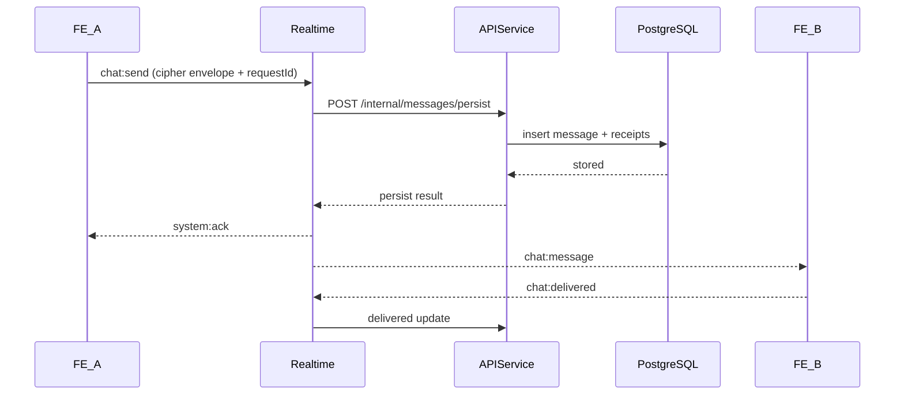

# 04 - Luồng Nghiệp Vụ Đầu Cuối

## Mục tiêu

Mô tả chi tiết từng bước cho chat và call để thành viên triển khai đúng thứ tự, rõ trách nhiệm, rõ nhánh lỗi và nhánh khôi phục.

## Điều kiện tiên quyết

- Hợp đồng API và event đã chốt: `02-api.md`, `03-events.md`.
- Người dùng đã đăng nhập và kết nối socket thành công.
- Socket auth được xác thực ở handshake (không gửi authToken trong từng event).
- Conversation đã có sẵn hoặc được tạo khi bắt đầu.
- Khóa E2EE ban đầu đã được thiết lập.

## Luồng A: Đăng ký và đăng nhập

1. FE submits email, username, password to `/auth/register/request-otp`.
2. API creates OTP request and sends email OTP.
3. FE submits OTP to `/auth/register/verify-otp`.
4. API creates account, returns access+refresh tokens.
5. FE stores tokens, initializes socket auth handshake.

Nhánh lỗi:
- OTP expired -> FE prompts resend OTP with cooldown UI.
- Too many OTP requests -> block and show retry timer.

Phân công:
- Phụ trách FE: trạng thái giao diện và biểu mẫu.
- Phụ trách API: vòng đời OTP và xác thực.
- System Owner: policy and security review.

## Luồng B: Bắt đầu cuộc trò chuyện

1. FE searches user via `/users/search` using `@username` or email.
2. FE calls `/conversations/direct` with `peerUserId`.
3. API returns `conversationId`.
4. FE joins conversation socket room through realtime.

Nhánh lỗi:
- user not found -> show empty result.
- permission denied -> hide restricted target.

## Luồng C: Gửi tin nhắn E2EE

Các bước chi tiết:

1. FE encrypts plaintext with active `keyVersion`.
2. FE emits `chat:send`.
3. Realtime validates schema and auth.
4. Realtime kiểm tra quyền thành viên conversation cho `senderUserId`.
5. Realtime calls API internal persist endpoint.
6. API persists and returns dedupe status.
7. Realtime emits ack and fanout.
8. Recipient decrypts and sends `chat:delivered`.
9. Read event emitted when recipient views conversation.

Nhánh lỗi:
- API persist fail -> realtime returns `system:error` retryable true.
- Key mismatch on recipient -> recipient emits `key:rekey_required`.
- Socket disconnect -> sender retries with same `requestId`.
- Sender không thuộc conversation -> realtime trả `PERMISSION_DENIED`.

Phân công theo bước:
- Phụ trách FE: bước 1, 2, 7, 8 và đồng bộ trạng thái giao diện.
- Phụ trách Realtime: bước 3, 6, routing và dedupe.
- Phụ trách API: bước 4, 5, lưu trữ và trạng thái.
- System Owner: key mismatch policy.

## Luồng D: Cuộc gọi thoại/video

1. Caller FE emits `call:start` with `callType` (`voice` or `video`).
2. Realtime emits `call:incoming` to callee.
3. Callee accepts/rejects.
4. If accepted:
   - offer/answer exchange via `call:offer` and `call:answer`.
   - ICE exchange via `call:ice`.
5. P2P media established; TURN fallback if direct path fails.
6. Either side emits `call:end`.

Nhánh lỗi:
- timeout without accept -> mark missed call.
- ICE gather/connect fail -> auto retry ICE then end with reason.
- reconnect during call -> attempt renegotiation window (max 20s).

Phân công theo bước:
- Phụ trách FE: quyền truy cập media và trạng thái giao diện cuộc gọi.
- Phụ trách Realtime: routing signaling và timeout.
- System Owner: call state machine and TURN fallback criteria.

## Luồng E: Reconnect và đồng bộ lại

1. Client reconnects socket with last known cursor/event marker.
2. Realtime re-authenticates and restores subscriptions.
3. FE fetches missed history via API fallback endpoint.
4. FE applies pending delivery/read sync.

Nhánh lỗi:
- token expired -> refresh token flow then reconnect.
- cursor too old -> full conversation sync via paginated API.

## Bóc tách công việc theo nhóm

- Việc của FE:
  - Chat send/retry queue with idempotent requestId.
  - Delivered/read state updates.
  - Call UI state machine for voice/video.
- Việc của API:
  - Internal message persist endpoint.
  - Search and conversation endpoints.
  - Receipt endpoints.
- Việc của Realtime:
  - Room subscription and presence events.
  - Signal routing and dedupe map.
  - Ack/error envelope standard.
- Việc của System Owner:
  - E2EE key mismatch/rekey strategy validation.
  - Integration acceptance tests and rollout gates.

