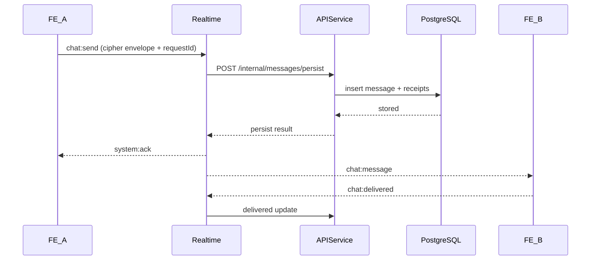

# 04 - Luồng Nghiệp Vụ Đầu Cuối

## Mục tiêu

Mô tả chi tiết từng bước cho chat và call để thành viên triển khai đúng thứ tự, rõ trách nhiệm, rõ nhánh lỗi và nhánh khôi phục.

## Điều kiện tiên quyết

- Hợp đồng API và event đã chốt: `02-api.md`, `03-events.md`.
- Người dùng đã đăng nhập và kết nối socket thành công.
- Socket auth được xác thực ở handshake (không gửi authToken trong từng event).
- Conversation đã có sẵn hoặc được tạo khi bắt đầu.
- Khóa E2EE ban đầu đã được thiết lập.

## Luồng A: Đăng ký và đăng nhập

1. FE gửi email, username, password tới `/auth/register/request-otp`.
2. API tạo yêu cầu OTP và gửi OTP qua email.
3. FE gửi OTP tới `/auth/register/verify-otp`.
4. API tạo tài khoản, trả access token + refresh token.
5. FE lưu token và khởi tạo socket auth ở bước handshake.

Nhánh lỗi:
- OTP hết hạn -> FE hiển thị gửi lại OTP với cooldown.
- Quá nhiều yêu cầu OTP -> chặn tạm thời và hiển thị thời gian thử lại.

Phân công:
- Phụ trách FE: trạng thái giao diện và biểu mẫu.
- Phụ trách API: vòng đời OTP và xác thực.
- System Owner: rà chính sách và cổng bảo mật.

## Luồng B: Bắt đầu cuộc trò chuyện

1. FE tìm user qua `/users/search` bằng `@username` hoặc email.
2. FE calls `/conversations/direct` with `peerUserId`.
3. API returns `conversationId`.
4. FE tham gia room socket của conversation qua realtime.

Nhánh lỗi:
- Không tìm thấy user -> hiển thị kết quả rỗng.
- Bị từ chối quyền -> ẩn đối tượng bị hạn chế.

## Luồng C: Gửi tin nhắn E2EE

Các bước chi tiết:

1. FE mã hóa plaintext với `keyVersion` đang hoạt động.
2. FE gửi event `chat:send`.
3. Realtime kiểm tra schema và auth context.
4. Realtime suy ra `senderUserId` từ auth context ở handshake, rồi kiểm tra quyền thành viên conversation.
5. Realtime gọi API nội bộ để persist.
6. API lưu bản ghi và trả trạng thái dedupe.
7. Realtime gửi ack và fanout.
8. Recipient giải mã và gửi `chat:delivered`.
9. Event đọc được gửi khi recipient mở conversation.

Nhánh lỗi:
- API persist lỗi -> realtime trả `system:error` với `retryable=true`.
- Key mismatch ở recipient -> recipient gửi `key:rekey_required`.
- Socket ngắt -> sender retry với cùng `requestId`.
- Sender không thuộc conversation -> realtime trả `PERMISSION_DENIED`.

Phân công theo bước:
- Phụ trách FE: bước 1, 2, 8, 9 và đồng bộ trạng thái giao diện.
- Phụ trách Realtime: bước 3, 4, 5, 7 (routing, authz, dedupe).
- Phụ trách API: bước 6 và đồng bộ trạng thái message/receipt.
- System Owner: chốt chính sách key mismatch/rekey.

## Luồng D: Cuộc gọi thoại/video

1. FE bên gọi gửi `call:start` với `callType` (`voice` hoặc `video`).
2. Realtime gửi `call:incoming` tới bên nhận.
3. Bên nhận chấp nhận hoặc từ chối.
4. Nếu chấp nhận:
   - trao đổi offer/answer qua `call:offer` và `call:answer`.
   - trao đổi ICE qua `call:ice`.
5. Thiết lập media P2P; fallback TURN nếu đường trực tiếp thất bại.
6. Một trong hai bên gửi `call:end`.

Nhánh lỗi:
- Hết thời gian chờ mà chưa accept -> đánh dấu cuộc gọi nhỡ.
- ICE gather/connect thất bại -> tự retry ICE rồi kết thúc kèm lý do.
- Mất kết nối giữa cuộc gọi -> thử renegotiation trong cửa sổ tối đa 20 giây.

Phân công theo bước:
- Phụ trách FE: quyền truy cập media và trạng thái giao diện cuộc gọi.
- Phụ trách Realtime: routing signaling và timeout.
- System Owner: chốt call state machine và tiêu chí fallback TURN.

## Luồng E: Reconnect và đồng bộ lại

1. Client reconnect socket với cursor/event marker gần nhất.
2. Realtime xác thực lại và khôi phục subscriptions.
3. FE lấy phần lịch sử bị lỡ qua API fallback endpoint.
4. FE áp dụng đồng bộ delivery/read còn treo.

Nhánh lỗi:
- Token hết hạn -> chạy flow refresh token rồi reconnect.
- Cursor quá cũ -> đồng bộ full conversation bằng API phân trang.

## Bóc tách công việc theo nhóm

- Việc của FE:
  - Queue gửi/retry chat với `requestId` idempotent.
  - Delivered/read state updates.
  - State machine UI cuộc gọi voice/video.
- Việc của API:
  - Endpoint persist tin nhắn nội bộ.
  - Endpoint tìm kiếm và conversation.
  - Receipt endpoints.
- Việc của Realtime:
  - Subscription room và event presence.
  - Routing signaling và bản đồ dedupe.
  - Chuẩn hóa envelope ack/error.
- Việc của System Owner:
  - E2EE key mismatch/rekey strategy validation.
  - Integration acceptance tests and rollout gates.

