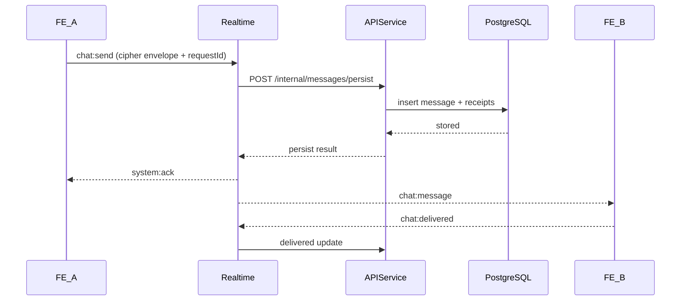

# 04 - Luồng Nghiệp Vụ Đầu Cuối

## Mục tiêu

Mô tả chi tiết từng bước cho chat và call để thành viên triển khai đúng thứ tự, rõ trách nhiệm, rõ nhánh lỗi và nhánh khôi phục.

## Điều kiện tiên quyết

- Hợp đồng API và event đã chốt: `02-api.md`, `03-events.md`.
- Người dùng đã đăng nhập và kết nối socket thành công.
- Socket auth được xác thực ở handshake (không gửi authToken trong từng event).
- Conversation đã có sẵn hoặc được tạo khi bắt đầu.
- Khóa E2EE ban đầu đã được thiết lập.

## Luồng A: Đăng ký và đăng nhập

1. FE gửi email, username, password tới `/auth/register/request-otp`.
2. API tạo yêu cầu OTP và gửi OTP qua email.
3. FE gửi OTP tới `/auth/register/verify-otp`.
4. API tạo tài khoản, trả access token + refresh token.
5. FE lưu token, wire `refreshHandler` trên API client, **rồi** upload ECDH prekey (`PUT /devices/me/ecdh-public-key`) và kết nối socket.

Nhánh lỗi:
- OTP hết hạn -> FE hiển thị gửi lại OTP với cooldown.
- Quá nhiều yêu cầu OTP -> chặn tạm thời và hiển thị thời gian thử lại.

Phân công:
- Phụ trách FE: trạng thái giao diện và biểu mẫu.
- Phụ trách API: vòng đời OTP và xác thực.
- System Owner: rà chính sách và cổng bảo mật.

## Luồng B: Bắt đầu cuộc trò chuyện

1. FE tìm user qua `/users/search` bằng `@username` hoặc email.
2. FE calls `/conversations/direct` with `peerUserId`.
3. API returns `conversationId` và (fire-and-forget) gọi realtime `POST /internal/conversations/notify-created`.
4. **Initiator (A):** FE gọi `markConversationOpenedByMe` — conv hiện trong sidebar dù chưa có tin.
5. **Peer (B):** conv **ẩn** trong sidebar cho đến khi có tin (`lastMessagePreview` từ API) hoặc nhận `chat:message`.
6. FE tham gia room socket khi **mở chat** (`loadMessages`). Peer online cũng **join room có chọn lọc** từ `conversation:created` nếu conv chưa có G-lite setup (hỗ trợ socket key exchange fallback).
7. Peer nhận `conversation:created` → refresh danh sách; join room chỉ khi `shouldAllowSocketKeyExchange` (conv vẫn ẩn trong sidebar nếu chưa có message).

Nhánh lỗi:
- Không tìm thấy user -> hiển thị kết quả rỗng.
- Bị từ chối quyền -> ẩn đối tượng bị hạn chế.

## Luồng C: Gửi tin nhắn E2EE



Các bước chi tiết:

1. FE hiển thị **bubble optimistic** ngay (`outboundStatus: pending_key`) trước khi wire send hoàn tất.
2. FE mã hóa plaintext với `keyVersion` đang hoạt động.
3. FE gửi event `chat:send` — bubble chuyển `sending` → `sent` (hoặc `failed`).
4. Sidebar sort theo `lastActivityAt` local; preview plaintext từ client (E2EE: server preview luôn null).
5. Realtime kiểm tra schema và auth context.
6. Realtime suy ra `senderUserId` từ auth context ở handshake, rồi kiểm tra quyền thành viên conversation.
7. Realtime gọi API nội bộ để persist.
8. API lưu bản ghi và trả trạng thái dedupe.
9. Realtime gửi ack và fanout.
10. Recipient giải mã và gửi `chat:delivered`.
11. Event đọc được gửi khi recipient mở conversation.

Nhánh lỗi:
- API persist lỗi -> realtime trả `system:error` với `retryable=true`.
- Key mismatch ở recipient -> recipient gửi `key:rekey_required`.
- Socket ngắt -> sender retry với cùng `requestId`.
- Sender không thuộc conversation -> realtime trả `PERMISSION_DENIED`.
- Peer chưa có prekey / socket timeout -> bubble `failed` + thông báo rõ (không treo `pending_key` mãi).
- Prekey upload thất bại sau login -> banner cảnh báo trên sidebar.

Phân công theo bước:
- Phụ trách FE: bước 1, 2, 8, 9 và đồng bộ trạng thái giao diện.
- Phụ trách Realtime: bước 3, 4, 5, 7 (routing, authz, dedupe).
- Phụ trách API: bước 6 và đồng bộ trạng thái message/receipt.
- System Owner: chốt chính sách key mismatch/rekey.

## Luồng D: Cuộc gọi thoại/video

1. FE bên gọi gửi `call:start` với `callType` (`voice` hoặc `video`).
2. Realtime gửi `call:incoming` tới bên nhận.
3. Bên nhận chấp nhận hoặc từ chối.
4. Nếu chấp nhận:
   - trao đổi offer/answer qua `call:offer` và `call:answer`.
   - trao đổi ICE qua `call:ice`.
5. Thiết lập media P2P; fallback TURN nếu đường trực tiếp thất bại.
6. Một trong hai bên gửi `call:end`.

Nhánh lỗi:
- Hết thời gian chờ mà chưa accept -> đánh dấu cuộc gọi nhỡ.
- ICE gather/connect thất bại -> tự retry ICE rồi kết thúc kèm lý do.
- Mất kết nối giữa cuộc gọi -> thử renegotiation trong cửa sổ tối đa 20 giây.

Phân công theo bước:
- Phụ trách FE: quyền truy cập media và trạng thái giao diện cuộc gọi.
- Phụ trách Realtime: routing signaling và timeout.
- System Owner: call state machine và tiêu chí fallback TURN — xem hai section dưới.

### Call State Machine (SYS-07)

Trạng thái và chuyển tiếp hợp lệ:

```
idle ──call:start──► ringing ──call:accept──► connecting ──ICE ok──► active
                        │                         │                      │
                    reject/end               end/ICE timeout          call:end
                    /timeout                      │                      │
                        └──────────────────────► ended ◄────────────────┘
```

| State | Phía | Ý nghĩa |
|-------|------|---------|
| `idle` | Client | Chưa có cuộc gọi |
| `ringing` | Client + Server | `call:start` đã emit; chờ accept/reject |
| `connecting` | Client only | `call:accept` nhận được; đang trao đổi SDP/ICE |
| `active` | Client + Server | Media đã thiết lập (ICE connected) |
| `ended` | Client + Server | Terminal — cuộc gọi kết thúc |

**Quy tắc chuyển tiếp:**

| Từ | Sự kiện | Đến | Ghi chú |
|----|---------|-----|---------|
| `idle` | `call:start` emit | `ringing` | Caller side |
| `idle` | `call:incoming` nhận | `ringing` | Callee side |
| `ringing` | `call:accept` | `connecting` | Callee gửi, caller nhận |
| `ringing` | `call:reject` hoặc `call:end` | `ended` | Bất kỳ bên |
| `ringing` | invite timeout | `ended` | `CALL_INVITE_TIMEOUT_MS` = 30s (realtime-service config) |
| `connecting` | ICE `connected` | `active` | Client-side only; server coi là active ngay sau accept |
| `connecting` | `call:end` | `ended` | Bất kỳ bên |
| `connecting` | ICE timeout | `ended` | `ICE_CONNECTION_TIMEOUT_MS` = 10s (xem `frontend/src/webrtc/config.ts`) |
| `active` | `call:end` | `ended` | Bất kỳ bên, kèm `reason` tuỳ chọn |
| `active` | mất kết nối socket | renegotiation window | Thử reconnect trong `CALL_RENEGOTIATION_WINDOW_MS` = 20s; quá hạn → `ended` |

**Edge cases:**
- **Call collision** (hai bên cùng `call:start` cùng lúc): bên có `userId` nhỏ hơn (lexicographic UUID) là caller; bên kia nhận `call:incoming` rồi tự `call:reject` call mình vừa khởi tạo.
- **ICE restart đồng thời**: caller (initiator) giữ quyền restart; callee bỏ qua offer nếu đang chờ offer của mình.
- **Phân tầng server/client**: Server (`callStore.ts`) chỉ track `ringing → active → ended`. State `connecting` là FE-side — server không biết ICE state.

### Chính sách TURN Fallback (SYS-08)

**Thứ tự ưu tiên ICE candidate:**
1. `host` — kết nối LAN trực tiếp
2. `srflx` — STUN: NAT traversal (không cần server relay)
3. `relay` — TURN: qua server relay; dùng khi hai loại trên thất bại

**Ngưỡng và hành vi:**

| Tình huống | Ngưỡng | Hành vi |
|-----------|--------|---------|
| ICE gathering chậm | `ICE_GATHERING_TIMEOUT_MS` = 4s | Dừng chờ, dùng candidates hiện có |
| P2P không kết nối được | `ICE_CONNECTION_TIMEOUT_MS` = 10s | Trigger ICE restart với TURN relay |
| ICE restart thất bại lần 2 | — | Fallback audio-only (nếu là video call) |
| Audio cũng fail | — | `call:end` với `reason: "ice_failed"` |

**Cấu hình `iceTransportPolicy`:**
- Mặc định: `"all"` — thử cả P2P và relay song song
- Chỉ dùng `"relay"` khi buộc phải qua TURN (debug hoặc môi trường NAT strict); không dùng mặc định vì tốn băng thông TURN server

**Ngưỡng fallback audio-only (SYS-20):**
- Trigger khi estimated available bitrate < `AUDIO_ONLY_FALLBACK_MIN_BITRATE_BPS` = 50 kbps liên tục trong `AUDIO_ONLY_FALLBACK_HOLD_DURATION_MS` = 3s
- Thực thi: FE dừng video track, giữ audio track — implement tại FE-23
- Constants export từ `frontend/src/webrtc/config.ts` để FE-23/25 dùng

**Cấu hình môi trường:**
- Local dev: bỏ `VITE_TURN_URL` trống → chỉ dùng Google STUN fallback
- Staging/prod: coturn trên VM; điền đủ `VITE_TURN_URL`, `VITE_TURN_USERNAME`, `VITE_TURN_CREDENTIAL`
- Credentials rotate theo chu kỳ vận hành (xem `docs/07-deployment-cicd.md`)

## Luồng E: Reconnect và đồng bộ lại

1. Client reconnect socket với cursor/event marker gần nhất.
2. Realtime xác thực lại và khôi phục subscriptions.
3. FE lấy phần lịch sử bị lỡ qua API fallback endpoint.
4. FE áp dụng đồng bộ delivery/read còn treo.

Nhánh lỗi:
- Token hết hạn -> chạy flow refresh token rồi reconnect.
- Cursor quá cũ -> đồng bộ full conversation bằng API phân trang.

## Bóc tách công việc theo nhóm

- Việc của FE:
  - Queue gửi/retry chat với `requestId` idempotent.
  - Delivered/read state updates.
  - State machine UI cuộc gọi voice/video.
- Việc của API:
  - Endpoint persist tin nhắn nội bộ.
  - Endpoint tìm kiếm và conversation.
  - Receipt endpoints.
- Việc của Realtime:
  - Subscription room và event presence.
  - Routing signaling và bản đồ dedupe.
  - Chuẩn hóa envelope ack/error.
- Việc của System Owner:
  - E2EE key mismatch/rekey strategy validation.
  - Integration acceptance tests and rollout gates.

